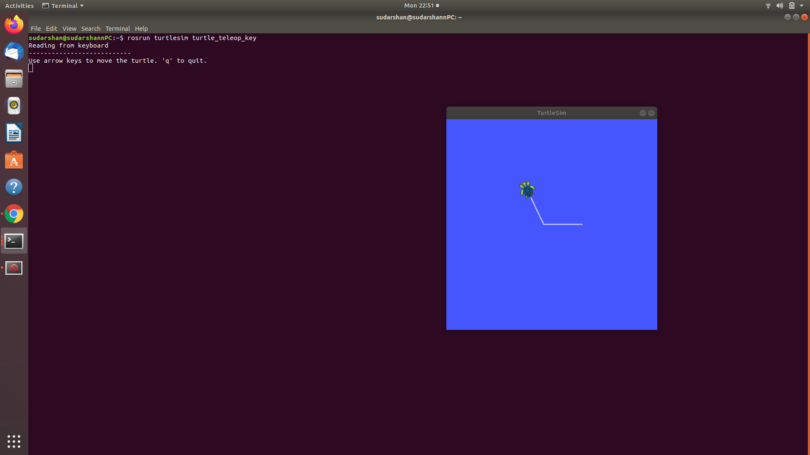

# Lab 1: Start the ROS Master node "ROSCORE"

## We can follow these 3 steps to open the **master node**

_Note: The ROS version is : 18.04, running on UBUNTU_

## Step 1

Use the following command in a **new terminal**

```
$ roscore
```

`roscore` is a collection of nodes and programs that are pre-requisites of a ROS-based system.  
The following 3 things will occur with this command.
roscore will start up:

-   a ROS Master
-   a ROS Parameter Server
-   a rosout logging node

## Step 2

Without closing the previous terminal, run the following command in a **new terminal**

```
$ rosrun turtlesim turtlesim_node
```

This will open the turtlesim in a new window.


## Step 3

Without closing the previous terminal(s), run the following command in a **new terminal**

```
$ rosrun turtlesim turtle_teleop_key
```

This will enable the controls of the turtle in the window using the arrow keys.


