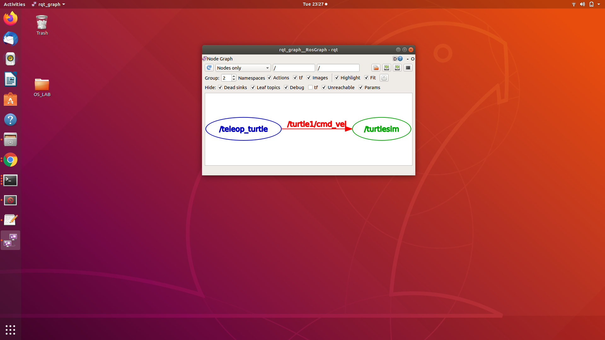
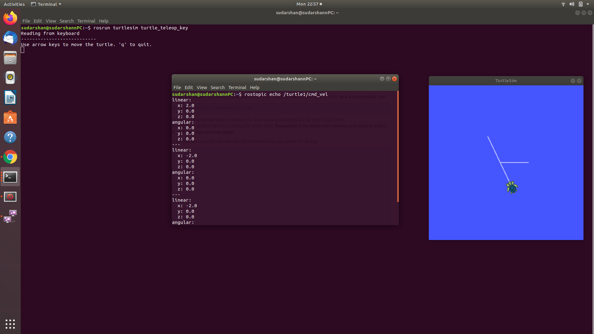
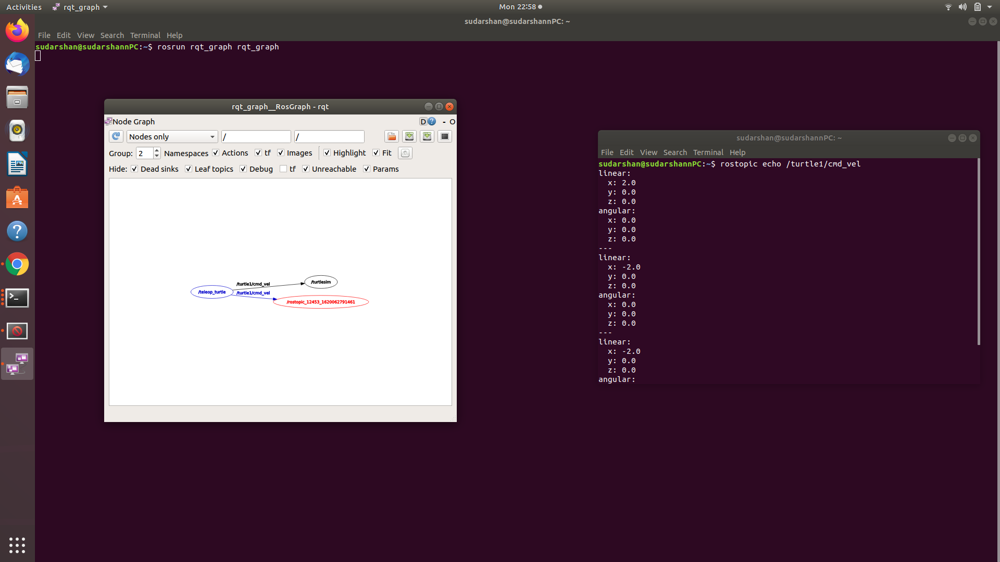
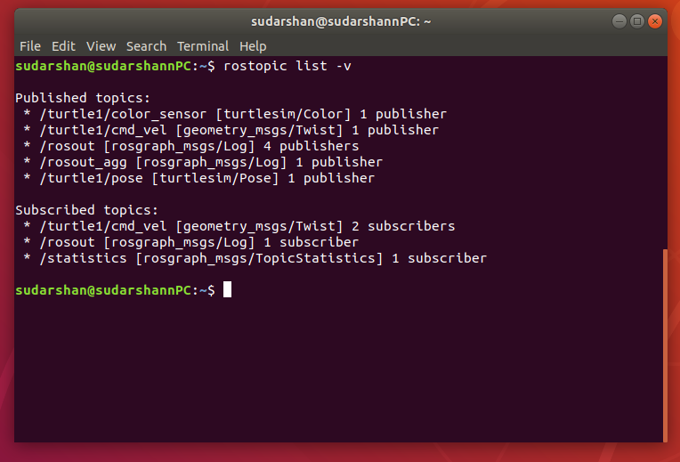
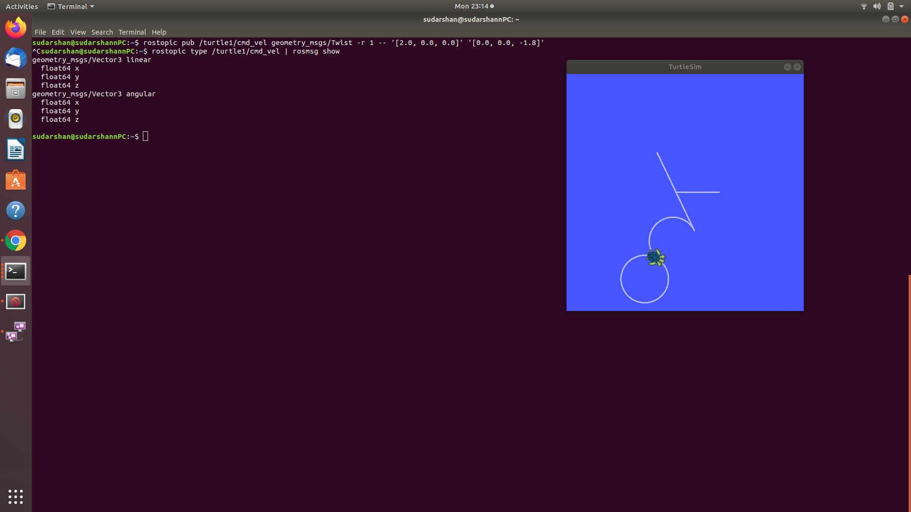
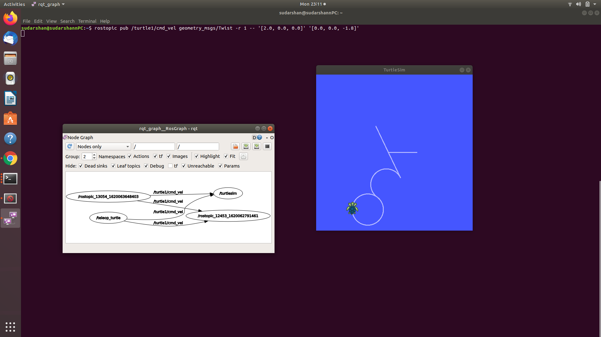
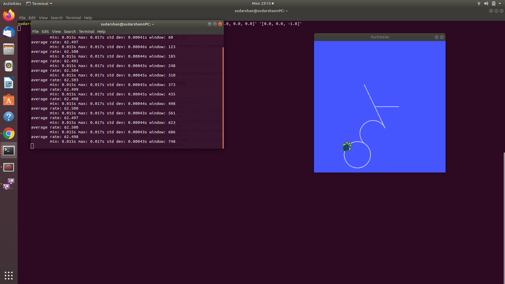
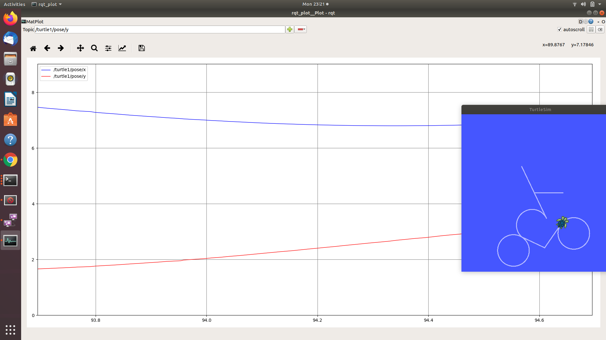
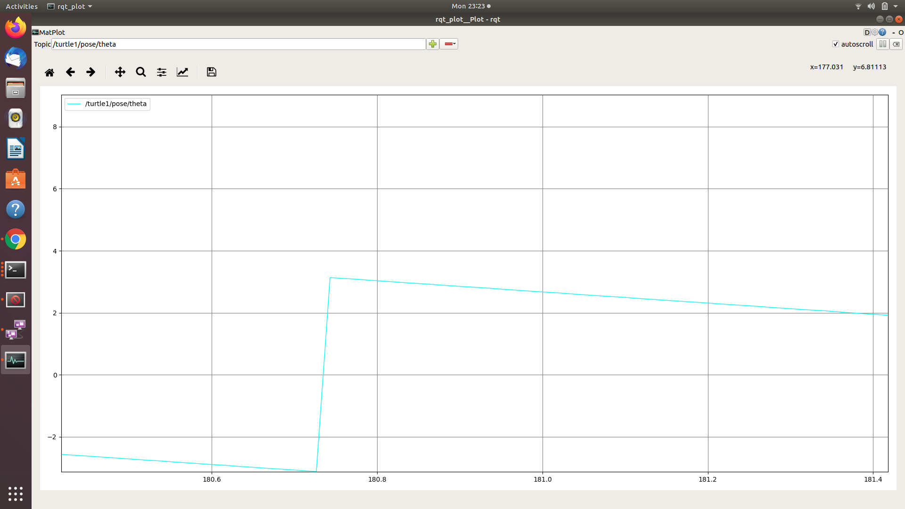

# Lab 2:Understanding ROS Topics, Node and Messages

## ROS Topics

The information in ROS is called a **topic**. A topic defines the types of messages that will be sent concerning that topic.

### **Using rqt_graph**

rqt_graph creates a dynamic graph of what's going on in the system. It shows the nodes and topics currently running.

```
$ rosrun rqt_graph rqt_graph
```



The turtlesim_node and the turtle_teleop_key node are communicating with each other over a ROS Topic named `/turtle1/command_velocity`.

### **Introducing rostopic**

_(Version Information: we are currently ROS hydro Or Later version)_

The rostopic tool allows you to get information about ROS topics.
following are some sub-commands for **rostopic**:

```
rostopic bw     // bandwidth used by topic.
rostopic echo   // print messages to screen
rostopic hz     // display publishing rate of topic
rostopic list   // print information about active topics
rostopic pub    // publish data to topic
rostopic type   // print topic type
```

following are some applied examples:

-   `rostopic echo` shows the data published on a topic.

    ```
    $ rostopic echo /turtle1/cmd_vel
    ```

    you should now see the following when you press the up key:

    

    

    As you can see, new node (**red color**), `rostopic echo`, is now also subscribed to the **turtle1/command_velocity** topic.

-   `rostopic list` returns a list of all topics currently subscribed to and published.

    ```
    $ rostopic list -v
    ```

    

### **ROS Messages**

-   `rostopic type` returns the message type of any topic being published.

    ```
    $ rostopic type /turtle1/cmd_vel | rosmsg show
    ```

    

*   `rostopic pub` publishes data on to a topic currently advertised.

    ```
    $ rostopic pub /turtle1/cmd_vel geometry_msgs/Twist -r 1 -- '[2.0, 0.0, 0.0]' '[0.0, 0.0, -1.8]'
    ```

    

    The previous command will send a single message to turtlesim telling it to move with a linear velocity of 2.0, and an angular velocity of 1.8 .

    This publishes the velocity commands at a rate of **1 Hz** on the velocity topic.

    This rqt_graph also shows that there are 6 nodes.

    

    Now you can see the turtlesim is publishing data about our turtle at the rate 62 Hz.

*   `rqt plot` displays a scrolling time plot of the data published on topics.

    ```
    $ rosrun rqt_plot rqt_plot
    ```

    In a new terminal. In the new window that should pop up, a text box in the upper left corner gives you the ability to add any topic to the plot.
    Typing /turtle1/pose/x will highlight the plus button, previously disabled. Press it and repeat the same procedure with the topic /turtle1/pose/y. You will now see the turtle's x-y location plotted in the graph.

    

    > "Pressing the minus button shows a menu that allows you to hide the specified topic from the plot. Hiding both the topics you just added and adding /turtle1/pose/theta will result in the plot shown in the next figure."

    

<!-- For Page Break -->
<!-- <div style="page-break-after: always; visibility: hidden">
\pagebreak
</div> -->
