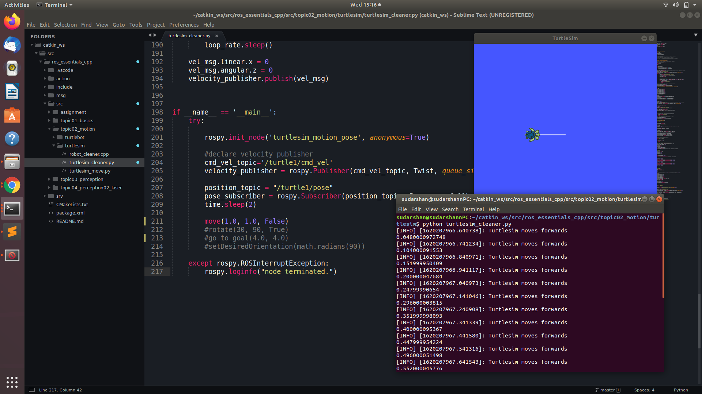
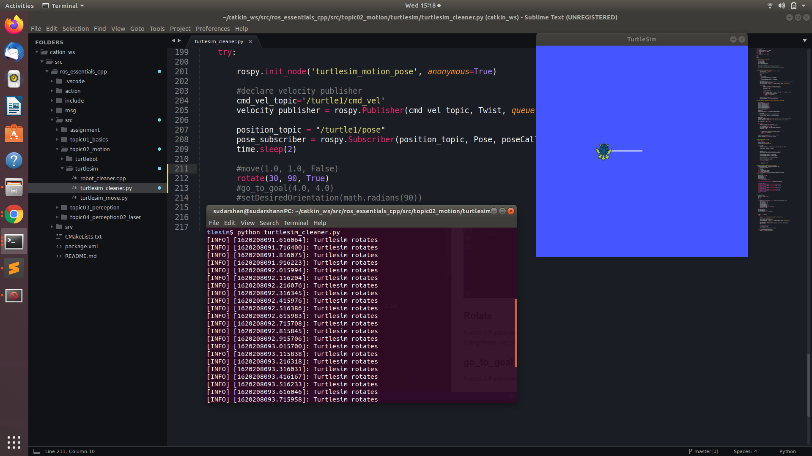
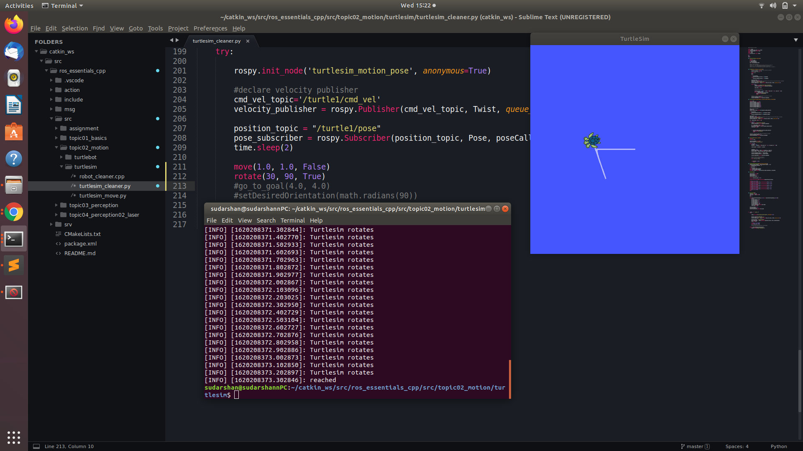
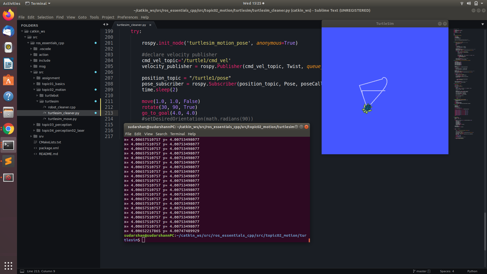
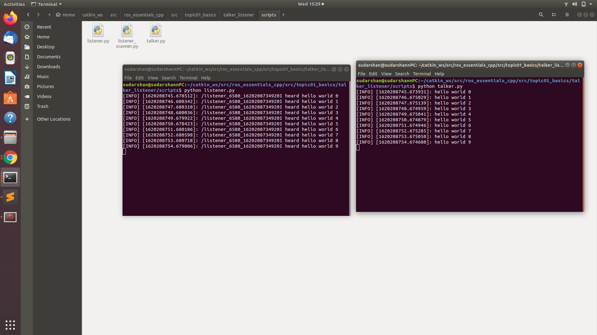
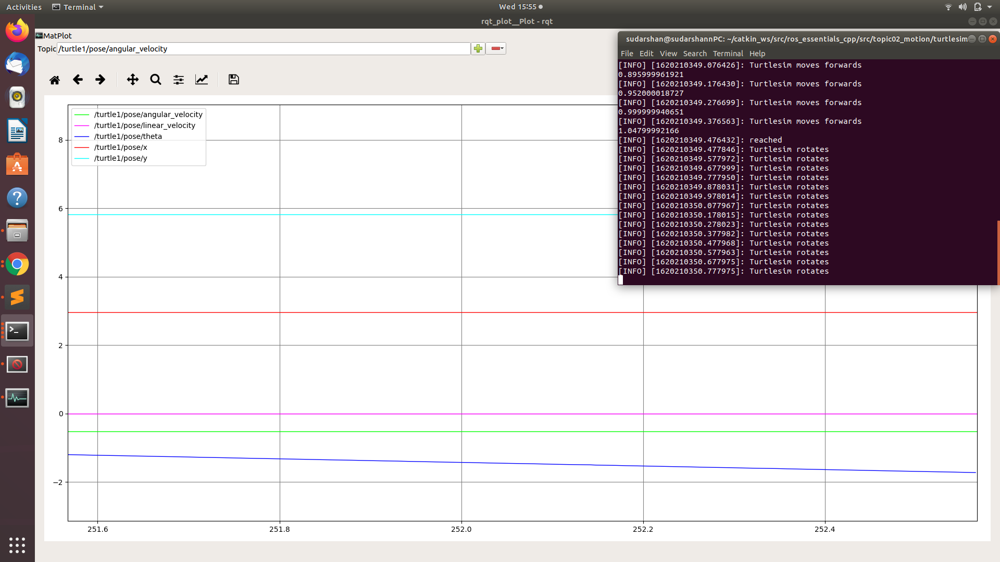
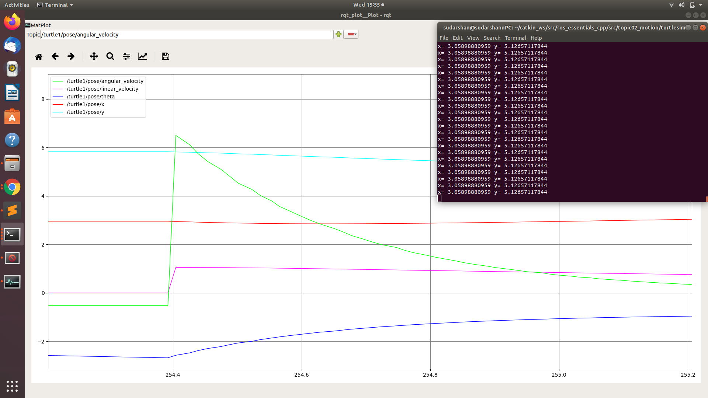
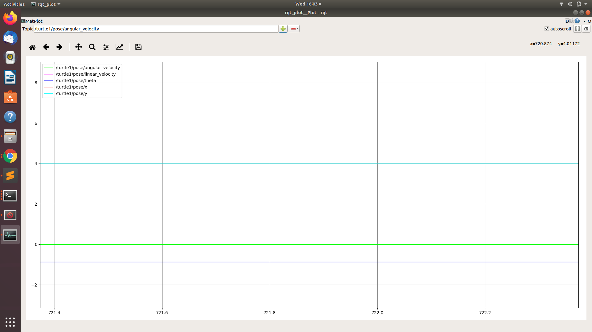

# Tutorial 3: ROS Publisher and Subscribers in C++ and Python

**We control turtlesim with code written in python or cpp.**

-   following are the source code links
    _[Source Code cpp](https://github.com/aniskoubaa/ros_essentials_cpp)_  
    _[Source Code python](https://github.com/aniskoubaa/ros_essentials_cpp/blob/master/src/topic02_motion/turtlesim/turtlesim_cleaner.py)_

There are 3 funtionsgiven in the code

1. move (move the turtle)
2. rotate (rotate the turtle)
3. go_to_goal (go to any point)

### Move

It uses 3 Parameters namely speed, distance and is_forward. Using these, we can move the turtle.



### Rotate

It uses 3 Parameters namely angular_speed_degree, relative_angle_degree, and clockwise. Using these, we can rotate turtle on its axis.



### go_to_goal

It uses 2 Paramters x_coordinate and y_coordinate, using this we can go to any given (x,y) coordinate


> Using move and rotate together



> Using All the three functionalities together



### Talker and Listener functionality

Run the following codes in the separate terminals

_[source code 1: Talker](https://github.com/aniskoubaa/ros_essentials_cpp/blob/master/src/topic01_basics/talker_listener/scripts/talker.py)_  
_[source code 2: Listener](https://github.com/aniskoubaa/ros_essentials_cpp/blob/master/src/topic01_basics/talker_listener/scripts/listener.py)_



> Here two terminals are open, one for the **talker** and another for the **listener**. When we run the talker code they print the data and send to the listener parallelly, we run listener code then they accept the talker request and print data same as a talker code output.

> **NOTE**: And the output never stops. We need to terminate the code using `ctrl+c`. This talker and listener code can be used to control manipulate the turtlebot

### RQT Plots of turtlesim Cleaner Code

We generated rqt codes using following commands:
```
rosrun rqt_plot rqt_plot
```
##### The following results are obtained





when turtle reach the point then all line are may constant and not change according to time



