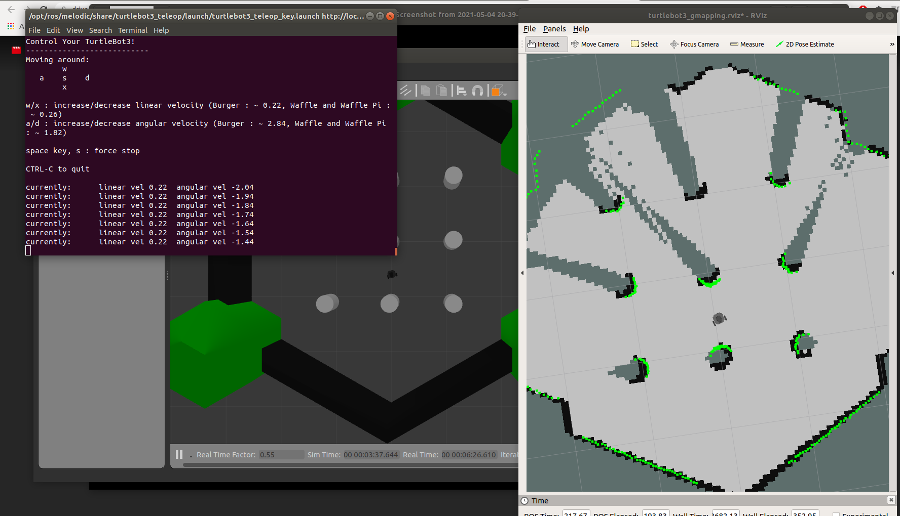

# Lab 7: ROS Localization (Machine Vision)

**We used <i>Gazebo</i> to simulate our robot in real time environment**

### Launch an empty world

Open a new terminal and run the following command.

```
$ roslaunch turtlebot3_gazebo turtlebot3_empty_world.launch
```

This will open an empty world with burger robot in gazebo.


### Launch a house world

Open a new terminal and run the following command.

```
$ roslaunch turtlebot3_gazebo turtlebot3_house.launch
```

This will open a house world with burger robot in gazebo.


### Launch an obstacle world

Open a new terminal and run the following command.

```
$ roslaunch turtlebot3_gazebo turtlebot3_world.launch
```

This will open an obstacle world with burger robot in gazebo.


### Controlling the robot

Using the following command we can now control the robot using W(up), A(left), S(down) and D(right) keys.

```
$ roslaunch turtlebot3_teleop turtlebot3_teleop_key.launch
```

### Navigation and SLAM for obstacle world

```
$ roslaunch turtlebot3_gazebo turtlebot3_world.launch
$ roslaunch turtlebot3_slam turtlebot3_slam.launch slam_methods:=gmapping
$   roslaunch turtlebot3_teleop turtlebot3_teleop_key.launch
```

Here we are mapping turtlebot3_house using SLAM(Simultaneous localization and mapping) gmapping algorithm to mapped turtlebot3_world.

To control our robot we used teleop command.




Here we are mapping through a laser sensor and due to obstacles the turtlebot can’t scan beyond the obstacle. Thus using teleop_key, we can pass the robot through the obstacle and so the remaining portion can be mapped.


This shows the mapping output after scanning.
