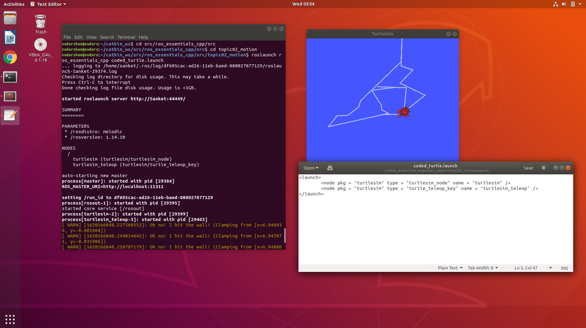
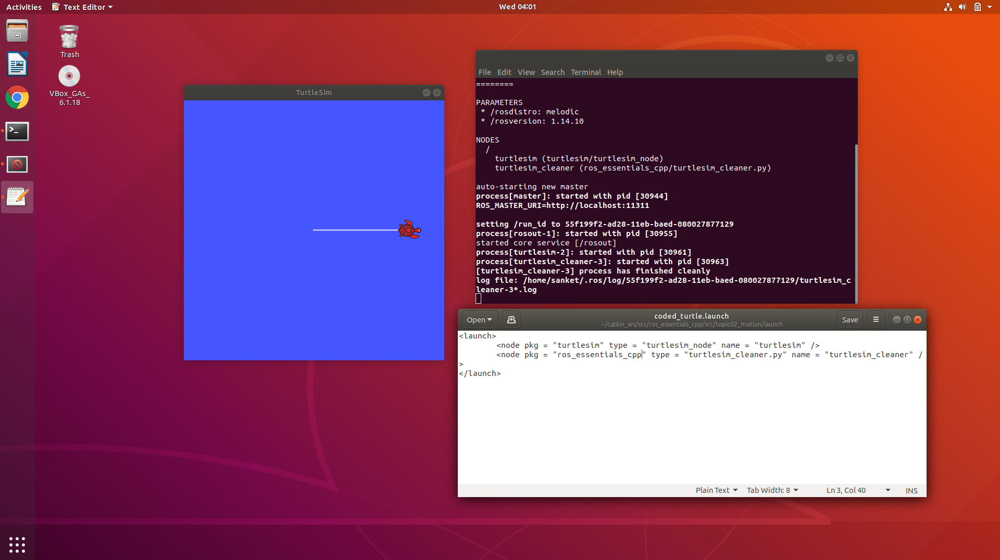

# Lab 5,6: ROS PID Controller

In this tutorial we learnt to launch turtlebot on a platform named `rviz`. Here it uses sensors for moving and for which it’s data is shown in rviz. To start the stage we need to write the command 
```
$ roslaunch turtlebot_stage turtlebot_in_stage.launch
```
in the terminal. Before doing that we need some required library to be installed.


---

Now we have to launch files and `roslaunch` command. Below is a snippet of executing `turtle_teleop_key` using launch file.



>We can do the same using a python file to remotely instruct the turtle instead of using `teleop_key`. as shown below.



