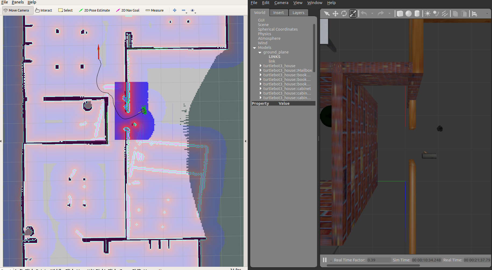
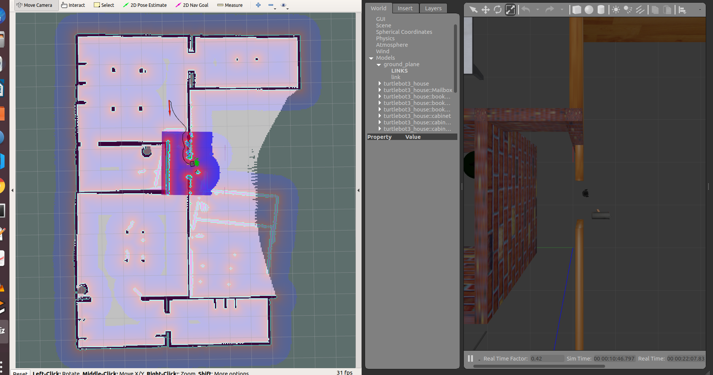
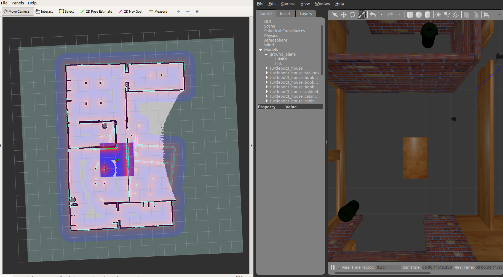

# Tutorial 6: Navigation and SLAM (AI/ML)

```
$ roslaunch turtlebot3_gazebo turtlebot3_house.launch
```

This will open the `house world` inside gazebo.

```

roslaunch turtlebot3_navigation turtlebot3_navigation.launch map_file:=$HOME/map.yaml
```

This will open the navigation menu

```
roslaunch turtlebot3_teleop turtlebot3_teleop_key.launch
```

With the help of this `teleop` command: we'll be able to control our robot

The following things were observed from the output:


> In the above figure the **greenish** dot is our robot _(right side `rviz section`)_ . The destination we want to reach is indicated using **red arrow**.



> The bluish area in the above figure indicates the spacious area and so the space is available`. The greenish-pink highlighted area shows that there is an obstacle.



> We can see that `rviz` and `gazebo` works in sync with other.

Gazebo _(left)_ acts as a real world reference where as rivz _(right)_ is for the sensory space vision.
