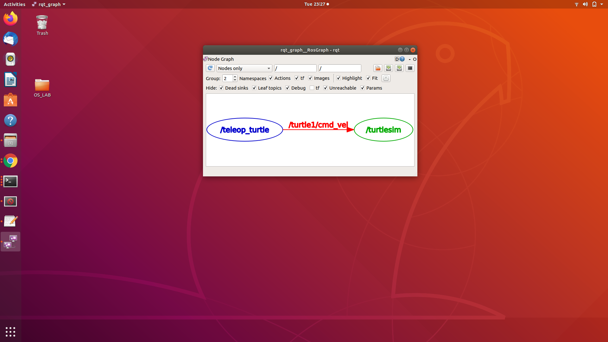
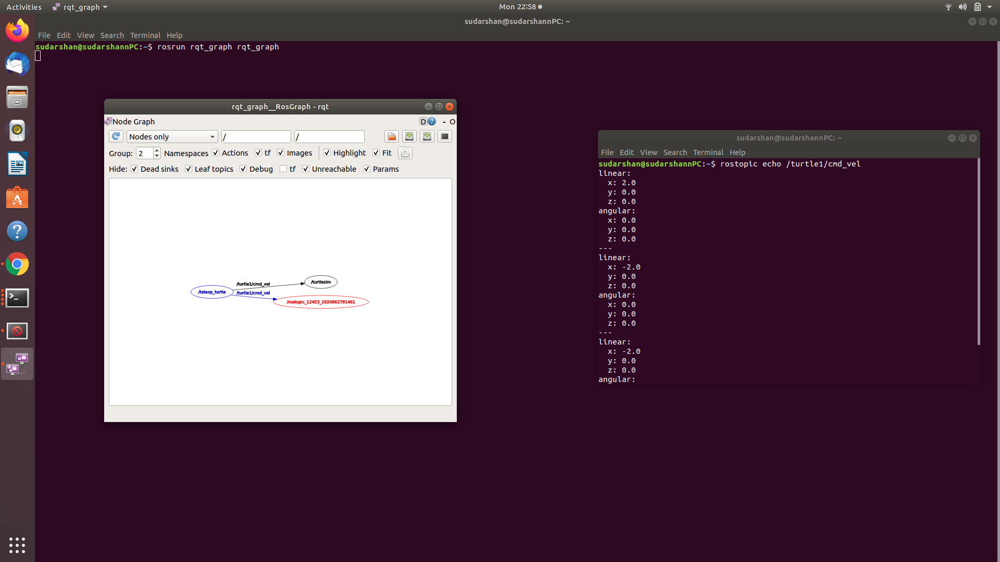
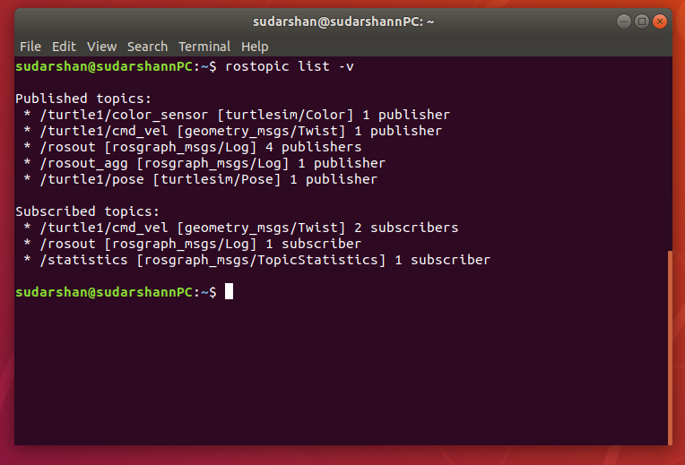
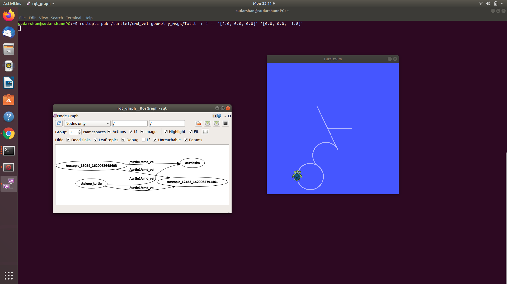
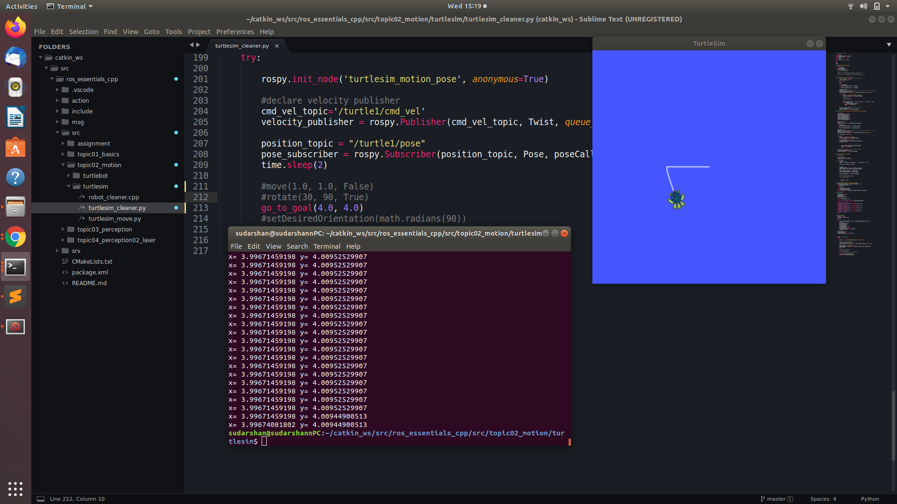
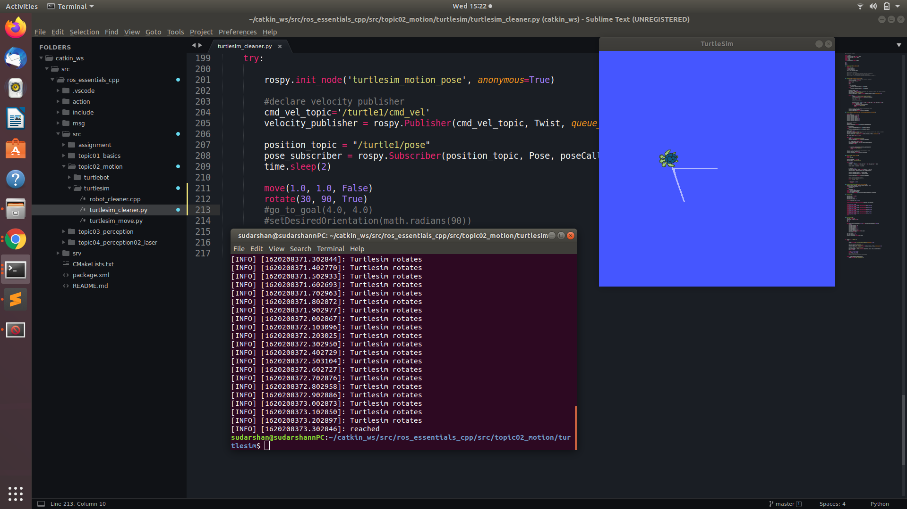

# Tutorial 1: Start the ROS Master node "ROSCORE"

## We can follow these 3 steps to open the **master node**

_Note: The ROS version is : 18.04, running on UBUNTU_

## Step 1

Use the following command in a **new terminal**

```
$ roscore
```

`roscore` is a collection of nodes and programs that are pre-requisites of a ROS-based system.  
The following 3 things will occur with this command.
roscore will start up:

-   a ROS Master
-   a ROS Parameter Server
-   a rosout logging node

## Step 2

Without closing the previous terminal, run the following command in a **new terminal**

```
$ rosrun turtlesim turtlesim_node
```

This will open the turtlesim in a new window.


## Step 3

Without closing the previous terminal(s), run the following command in a **new terminal**

```
$ rosrun turtlesim turtle_teleop_key
```

This will enable the controls of the turtle in the window using the arrow keys.


<div style="page-break-after: always; visibility: hidden">
\pagebreak
</div>

# Tutorial: 2 Understanding ROS Topics, Node and Messages

## ROS Topics

The information in ROS is called a **topic**. A topic defines the types of messages that will be sent concerning that topic.

### **Using rqt_graph**

rqt_graph creates a dynamic graph of what's going on in the system. It shows the nodes and topics currently running.

```
$ rosrun rqt_graph rqt_graph
```



The turtlesim_node and the turtle_teleop_key node are communicating with each other over a ROS Topic named `/turtle1/command_velocity`.

### **Introducing rostopic**

_(Version Information: we are currently ROS hydro Or Later version)_

The rostopic tool allows you to get information about ROS topics.
following are some sub-commands for **rostopic**:

```
rostopic bw     // bandwidth used by topic.
rostopic echo   // print messages to screen
rostopic hz     // display publishing rate of topic
rostopic list   // print information about active topics
rostopic pub    // publish data to topic
rostopic type   // print topic type
```

following are some applied examples:

-   `rostopic echo` shows the data published on a topic.

    ```
    $ rostopic echo /turtle1/cmd_vel
    ```

    you should now see the following when you press the up key:

    

    

    As you can see, new node (**red color**), `rostopic echo`, is now also subscribed to the **turtle1/command_velocity** topic.

-   `rostopic list` returns a list of all topics currently subscribed to and published.

    ```
    $ rostopic list -v
    ```

    

### **ROS Messages**

-   `rostopic type` returns the message type of any topic being published.

    ```
    $ rostopic type /turtle1/cmd_vel | rosmsg show
    ```

    

*   `rostopic pub` publishes data on to a topic currently advertised.

    ```
    $ rostopic pub /turtle1/cmd_vel geometry_msgs/Twist -r 1 -- '[2.0, 0.0, 0.0]' '[0.0, 0.0, -1.8]'
    ```

    

    The previous command will send a single message to turtlesim telling it to move with a linear velocity of 2.0, and an angular velocity of 1.8 .

    This publishes the velocity commands at a rate of **1 Hz** on the velocity topic.

    This rqt_graph also shows that there are 6 nodes.

    

    Now you can see the turtlesim is publishing data about our turtle at the rate 62 Hz.

*   `rqt plot` displays a scrolling time plot of the data published on topics.

    ```
    $ rosrun rqt_plot rqt_plot
    ```

    In a new terminal. In the new window that should pop up, a text box in the upper left corner gives you the ability to add any topic to the plot.
    Typing /turtle1/pose/x will highlight the plus button, previously disabled. Press it and repeat the same procedure with the topic /turtle1/pose/y. You will now see the turtle's x-y location plotted in the graph.

    

    > "Pressing the minus button shows a menu that allows you to hide the specified topic from the plot. Hiding both the topics you just added and adding /turtle1/pose/theta will result in the plot shown in the next figure."

    

<div style="page-break-after: always; visibility: hidden">
\pagebreak
</div>

# Tutorial 3: ROS Publisher and Subscribers in C++ and Python

**We control turtlesim with code written in python or cpp.**

-   following are the source code links
    _[Source Code cpp](https://github.com/aniskoubaa/ros_essentials_cpp)_  
    _[Source Code python](https://github.com/aniskoubaa/ros_essentials_cpp/blob/master/src/topic02_motion/turtlesim/turtlesim_cleaner.py)_

There are 3 funtionsgiven in the code

1. move (move the turtle)
2. rotate (rotate the turtle)
3. go_to_goal (go to any point)

### Move

It uses 3 Parameters namely speed, distance and is_forward. Using these, we can move the turtle.


### Rotate

It uses 3 Parameters namely angular_speed_degree, relative_angle_degree, and clockwise. Using these, we can rotate turtle on its axis.


### go_to_goal

It uses 2 Paramters x_coordinate and y_coordinate, using this we can go to any given (x,y) coordinate



> Using move and rotate together



> Using All the three functionalities together


### Talker and Listener functionality

Run the following codes in the separate terminals

_[source code 1: Talker](https://github.com/aniskoubaa/ros_essentials_cpp/blob/master/src/topic01_basics/talker_listener/scripts/talker.py)_  
_[source code 2: Listener](https://github.com/aniskoubaa/ros_essentials_cpp/blob/master/src/topic01_basics/talker_listener/scripts/listener.py)_


> Here two terminals are open, one for the **talker** and another for the **listener**. When we run the talker code they print the data and send to the listener parallelly, we run listener code then they accept the talker request and print data same as a talker code output.

> **NOTE**: And the output never stops. We need to terminate the code using `ctrl+c`. This talker and listener code can be used to control manipulate the turtlebot

<!-- For Page Break -->
<!-- <div style="page-break-after: always; visibility: hidden">
\pagebreak
</div> -->
